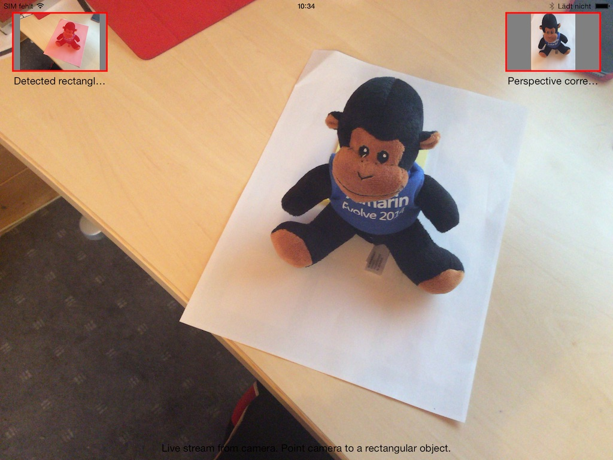

RectangleDetection.iOS
======================

iPad / iPhone (iOS 8.1) project that shows how to capture the camera's video stream, add it to a UIView for out,
process it, detect rectangles using CIDetector, overlay detected rectangles in the live image and apply
a perspective transform to the detected rectangular area.

I wrote this because I needed to detect rectangles for a small private project of mine. It turned out that
this wasn't all so obvious. There are some sample out there in ObjectiveC or Swift but I have not found a comprehensive
one written with Xamarin.iOS.

The demo contains many comments and should make it easy for you to get started with video processing and
shape detection on iOS8.

It is also optimized for memory and disposes everything nicely, which can be a real pain if you work with CIImage.

* CIDetector: used to detected rectangles
* AVCaptureSession: overall handling of the video stream
* AVCaptureVideoPreviewLayer: add stream to a UIView
* AVCaptureVideoDataOutputSampleBufferDelegate: get notified about new grabbed images
* CIPerspectiveTransformWithExtent: draw an overlay on detected ractangles
* CIPerspectiveCorrection: apply a perspective correction to "fix" the detected rectangular images

This demo is inspired by:

* http://www.shinobicontrols.com/blog/posts/2014/08/05/ios8-day-by-day-day-13-coreimage-detectors
* https://github.com/xamarin/monotouch-samples/tree/master/MediaCapture

